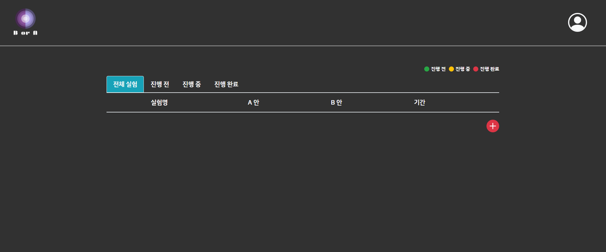
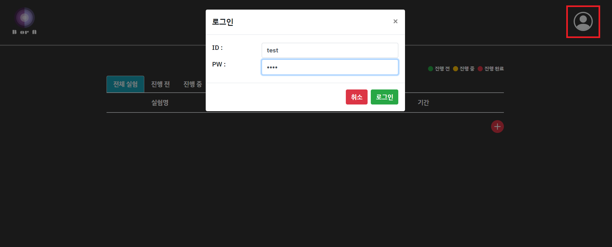
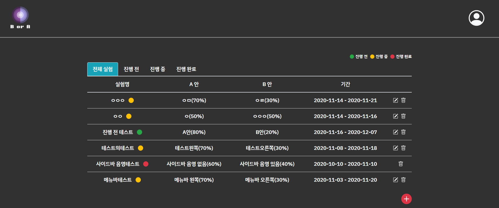
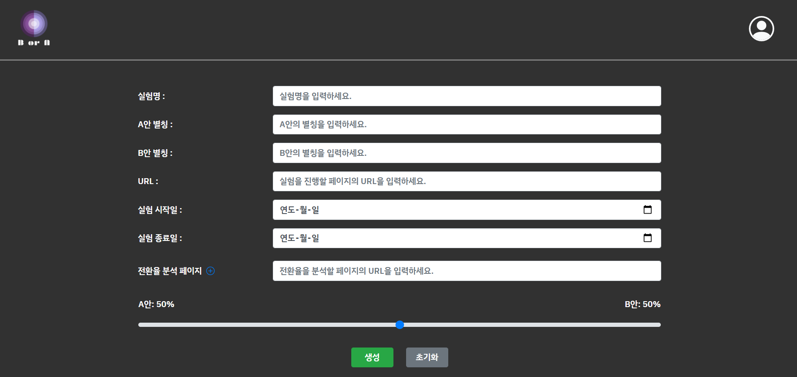
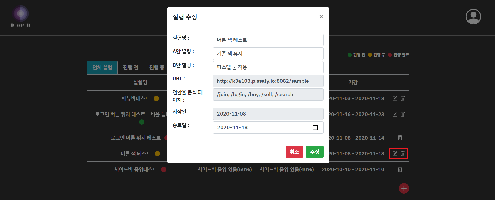

A/B Testing Solution '보라'
===========================

## 개요

## A/B 테스트?

- A/B 실험이란 두개의 변형 A와B를 사용하는 종합 대조 실험(controlled experiment)으로 A 와 B 중 어떤 것이 더 효과적인지 판단하는 실험 입니다.

## Objective

기업은 항상 소비자의 니즈를 위한 도전을 하지만
새로운 도전이 꼭 좋은 결과를 가져오지는 않습니다.
그렇기 때문에 A/B 실험을 참고해 선택하는 것이 합리적인 선택이 될 것입니다.

## AorB

A/B Test 솔루션인 저희 AorB의 흐름입니다.

1. 기업의 입장인 클라이언트는 AorB 솔루션을 통해 실험을 생성합니다.
2. 실험 생성 후, 소비자인 컨슈머가 클라이언트의 페이지에 접속을 하게 되면 페이지는 API 요청을 합니다.
3. 이후 API서버에서는 admin server와 통신을 통해 얻은 실험 데이터로 A 혹은 B를 선정해 클라이언트 페이지에 응답하고 컨슈머는 해당 페이지를 보게됩니다.
4. 이후 컨슈머가 이벤트를 발생시키면 데이터들을 admin 서버에 전송이 된 뒤 시각화가 진행됩니다.

## 기능

1. 메인화면(로그인 전) : 로그인을 하지 않으면 서비스가 제공되지 않는다.
   

2. 로그인 : 오른쪽 위에 사람 모양을 누르면 로그인창이 나옵니다.
   

3. 메인화면(로그인 후) : 현재 진행중인 a/b 테스트의 현황과 상태를 보여줍니다.
   

4. 메인화면(진행전) : 현재 진행대기중인 a/b 테스트를 보여줍니다.
   .png>)

5. 메인화면(진행중) : 현재 진행중인 a/b 테스트를 보여줍니다.
   .png>)

6. 메인화면(진행완료) : 현재 진행완료된 a/b 테스트를 보여줍니다.
   .png>)

7. 생성 : + 버튼을 눌러 생성을 할 수 있는 페이지 입니다.
   

8. 수정 및 삭제 : 아이콘을 클릭해 수정과 삭제를 할 수 있습니다. 수정은 기본적인 명칭, 종료일은 수정 가능하지만 URL, 전환율분석페이지, 시작일은 수정할 수 없습니다.
   

9. 상세(전체) :

## Architecture
- OS : Ubuntu
- version
    - Database : My-SQL
    - Back-end : Java(V. 14), Spring (V. 2.3.4)., Kafka
    - Front-end: JavaScript, vue.js (V. 3.x, use yarn)등
- infra
    - EC2
    - GitLab


## Port
- Front
    - Dashboard : 8081 
    - Sample page : 8082
- Back
    - Server : 3030
- MariaDB : 3306 
- Jenkins : 8080
- nginx : 80

# FrontEnd

## Project setup

```
yarn install
```

### Compiles and hot-reloads for development

```
yarn serve
```

### Compiles and minifies for production

```
yarn build
```

### Lints and fixes files

```
yarn lint
```

### Customize configuration

See [Configuration Reference](https://cli.vuejs.org/config/).

# BackEnd

### Compiles and hot-reloads for development

```
./mvnw spring-boot:run
```

### API
Get : http://k3a103.p.ssafy.io/api/assign

## request
<pre>
<code>
{
    url : "String",
}
</code>
</pre>

## response
<code>
{
    "status": true, 
    "data": "success", 
    "object": A or B
 }

</code>

Post : http://k3a103.p.ssafy.io/api/assign
## request
<pre>
<code>
{
    "test_no" : int,
    "page_type" : "string",
    "session_id" : "string",
    "url" : "string" (넘어갈 유알엘),
    "date" : date ,
    signed:boolean,
    user {
        email : "string",
        gender : "string",
        age : int,
        join_date : date
    }
}
<code>
</pre>

## response
<pre>
<code>
{
    "status" : true,
    "data" : "success" ,
    "object" : null
} 
<code>
</pre>